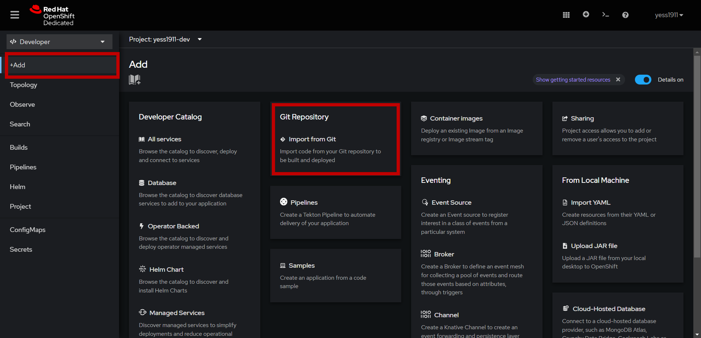
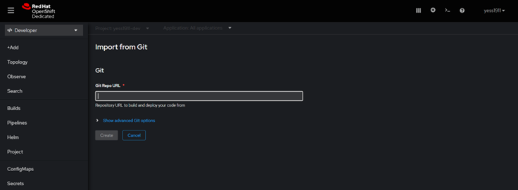
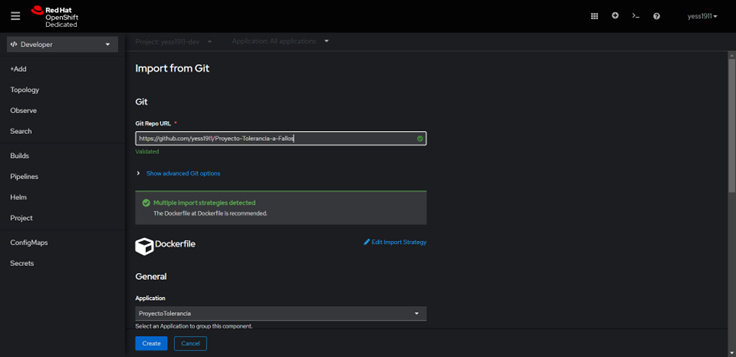
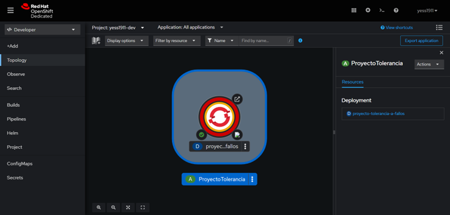

# ⚠🖥Proyecto - Computación Tolerante a Fallas 🖥⚠
En este repositorio se encuentra el proyecto final para la materia Computacion tolerante a fallas D06 Profesor: Michel Emanuel Lopez Franco.


## Autores 👋

* **Carbajal Armenta Yessenia Paola** 
* **Ortiz Perez Luis Alfonso** 
* **Sanchez Lozano Jonathan** 


## Descripción
La aplicacion web es una aplicacion de generador de contraseñas, el usuario ingresa el tamaños de a cadena de caracteres, señala si puede incluir Mayúsculas, Minúsculas, Números y Símbolos

Elaborada con:

    Html
    Css
    Javascript

Tecnologias para el despliegue de la aplicación:
    
    Docker 
    OpenShift
    
## Despligues


### 🐳🖥 Docker 🖥🐳
Descargamos e instalamos Docker en el equipo:
https://www.docker.com/products/docker-desktop/
Seleccionamos el tipo de sistema operativo, una vez terminada la instalación nos pedirá reiniciar el equipo.
Abrimos CMD y comprobamos la instalación con: ``` docker versión ``` o ```docker –version```

##

Creamos un archivo ‘Dockerfile’ (un archivo Docker que tendrá las nstrucciones necesarias para crear el entorno)


Una vez que tu código esté listo y el Dockerfile está escrito, todo lo que tienes que hacer es crear tu imagen para contener tu aplicación.
```docker build -t "nombre:tag" .``` 

En nuestro caso:
```docker build -t html-server-image:v1 .```


Mostramos las imagenes de docker con
```docker images```


Mostramos las imagenes de docker con
```docker images```


Creada la imagen realizamos el lanzamiento:
```docker run -d -p 80:80 html-server-image:v1```


En Docker desktop podemos realizar el despliegue de la siguiente manera:
1. Seleccionamos la imagen creada y la corremos


2. Seleccionamos el contenedor con la imagen de que creamos y damos click en el puerto 80:80


Se habre el navegador web por defecto y nos aparece la aplicacion:


##

### ⭕🖥 OpenShift 🖥⭕
Ingresamos a la página web de RedHat, creamos un perfil e ingresamos para usar DevSandBox.
https://developers.redhat.com/developer-sandbox

##

Una vez dentro del DevSandBox, nos posicionamos en la navegación como “Developer”.

 
Una vez en la posicionados en la vista de “Developer” nos dirigimos a la sección de “Add” para agregar nuestra app que en esta ocasión será mediante la opción de “Git Repository”.

 
En esta pestaña añadimos la URL de nuestro repositorio de GitHub y así procedemos a crear nuestra app en OpenShift.



Ahora en la sección de “Topology” podemos ver que el deploy de nuestra app está listo y en ejecución.

 
Finalmente abrimos en otra pestaña nuestra app para comprobar que todo funciona de manera satisfactoria.
 


