# ⚠🖥Proyecto - Computación Tolerante a Fallas 🖥⚠
En este repositorio se encuentra el proyecto final para la materia Computacion tolerante a fallas D06 Profesor: Michel Emanuel Lopez Franco.

<p align="center">
  
</p>

## Autores 📝🏻

* **Carbajal Armenta Yessenia Paola** 
* **Ortiz Perez Luis Alfonso** 
* **Sanchez Lozano Jonathan** 


## Herramientas🛠️

Elaborada con:

    Html
    Css
    Javascript

Tecnologias para el despliegue de la aplicación:
    
    Docker 
    OpenShift

## Descripción🔑
La aplicacion web es una aplicacion de generador de contraseñas, el usuario ingresa el tamaños de la cadena de caracteres, señala si puede incluir Mayúsculas, Minúsculas, Números y Símbolos, en ella se pueden obtener 4 diferentes niveles de "fuerza":

* **Muy Débil** 
* **Débil** 
* **Medio** 
* **Fuerte** 

<p align="center">
  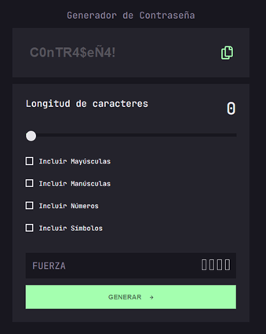
</p>


Esta cuenta con varias validaciones como la dependencia de comparar que selecciones de casillas hace el usuario, si por ejemplo, selecciona pocos caracteres y pocas inclusiones de casillas esta será débil pero de igual forma se podrá generar.

<p align="center">
  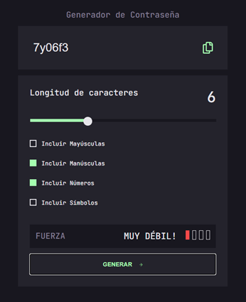
</p>

Por otro lado, si se selecciona una alta cantidad de caracteres y todas las casillas (o la mayoria), la contraseña que se generará será más fuerte.

<p align="center">
  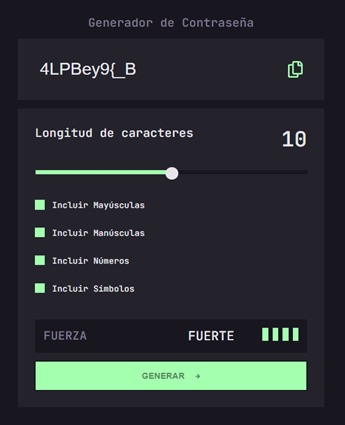
</p>  

Además de generar la contraseña, la app cuenta con la función de copiar en el portapapeles la contraseña mediante un botón, el cual se ubica dentro del recuadro donde se genera y que al hacerle clic aparece el mensaje de "copied".

<p align="center">
  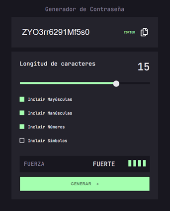
</p> 


## Despligues🖥


### 🐳 Docker 🐳
Descargamos e instalamos Docker en el equipo:
https://www.docker.com/products/docker-desktop/
Seleccionamos el tipo de sistema operativo, una vez terminada la instalación nos pedirá reiniciar el equipo.
Abrimos CMD y comprobamos la instalación con: ``` docker versión ``` o ```docker –version```

Creamos un archivo ‘Dockerfile’ (un archivo Docker que tendrá las nstrucciones necesarias para crear el entorno) 

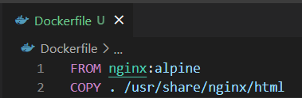

Una vez que tu código esté listo y el Dockerfile está escrito, todo lo que tienes que hacer es crear tu imagen para contener tu aplicación.
```docker build -t "nombre:tag" .``` 

En nuestro caso:
```docker build -t html-server-image:v1 .```

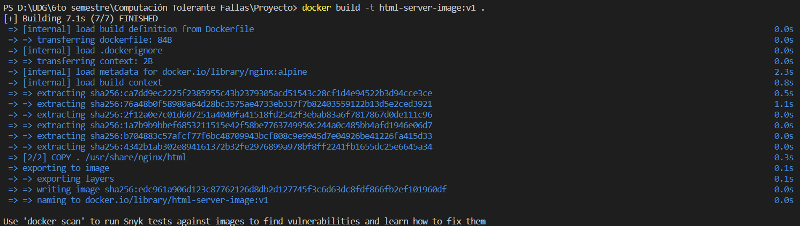

Mostramos las imagenes de docker con
```docker images```

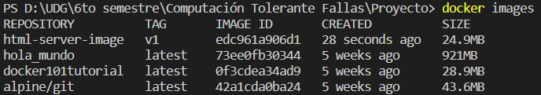

Mostramos las imagenes de docker con
```docker images```


Creada la imagen realizamos el lanzamiento:
```docker run -d -p 80:80 html-server-image:v1```

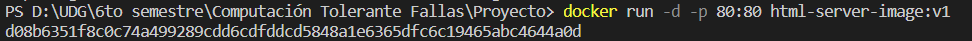

En Docker desktop podemos realizar el despliegue de la siguiente manera:
1. Seleccionamos la imagen creada y la corremos

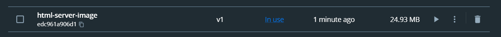

2. Seleccionamos el contenedor con la imagen de que creamos y damos click en el puerto 80:80

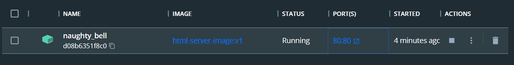

Se habre el navegador web por defecto y nos aparece la aplicacion:

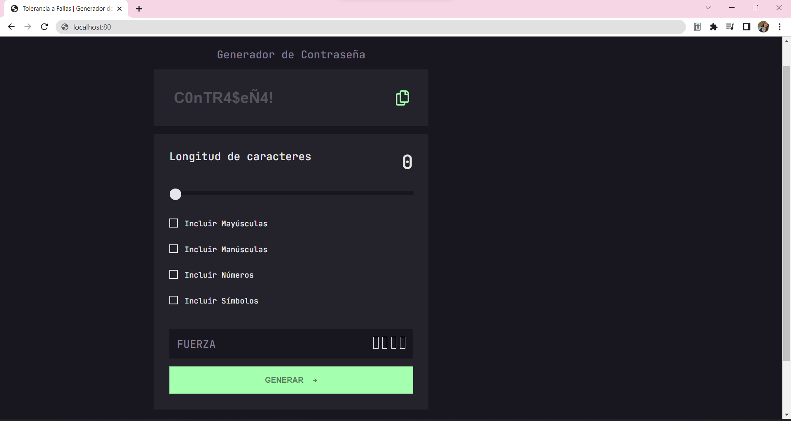

##

### ⭕ OpenShift ⭕
Ingresamos a la página web de RedHat, creamos un perfil e ingresamos para usar DevSandBox.
https://developers.redhat.com/developer-sandbox

##

Una vez dentro del DevSandBox, nos posicionamos en la navegación como “Developer”.

<p align="center">
  
</p> 
 
Una vez en la posicionados en la vista de “Developer” nos dirigimos a la sección de “Add” para agregar nuestra app que en esta ocasión será mediante la opción de “Git Repository”.

<p align="center">
  
</p>
 
En esta pestaña añadimos la URL de nuestro repositorio de GitHub y así procedemos a crear nuestra app en OpenShift.

<p align="center">
  
</p> 

<p align="center">
  
</p> 


Ahora en la sección de “Topology” podemos ver que el deploy de nuestra app está listo y en ejecución.

<p align="center">
  
</p>
 
Finalmente abrimos en otra pestaña nuestra app para comprobar que todo funciona de manera satisfactoria.
 
 <p align="center">
  
</p>

##

### ☸ Kubernetes ☸
Ingresamos a la página web de RedHat, creamos un perfil e ingresamos para usar DevSandBox.
https://developers.redhat.com/developer-sandbox

##

Una vez dentro del DevSandBox, nos posicionamos en la navegación como “Developer”.
